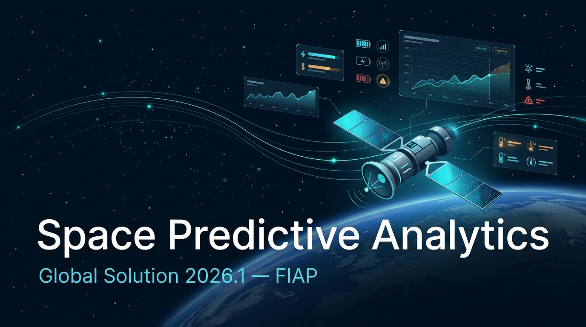
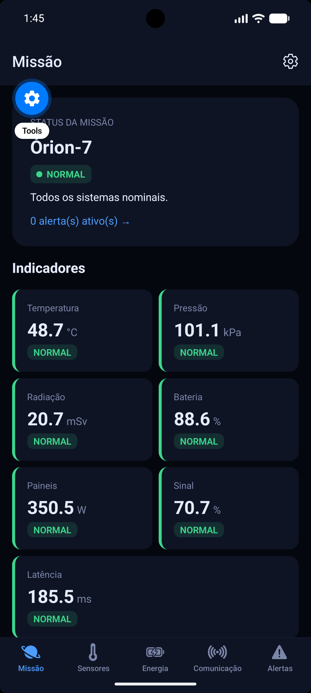
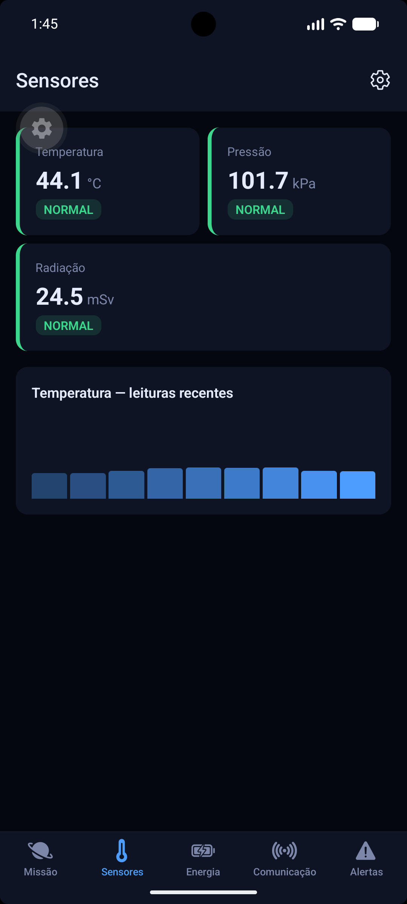
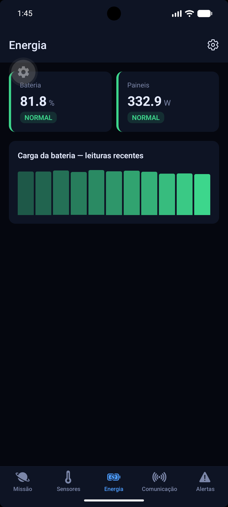
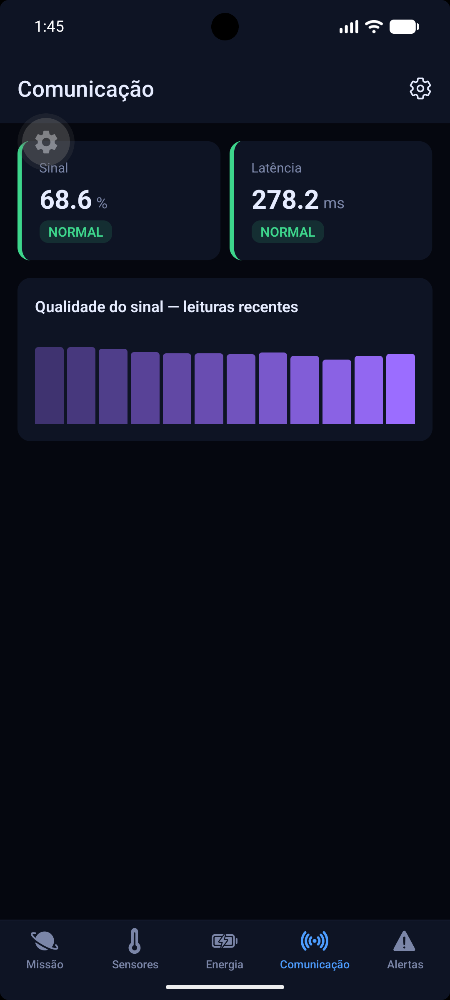
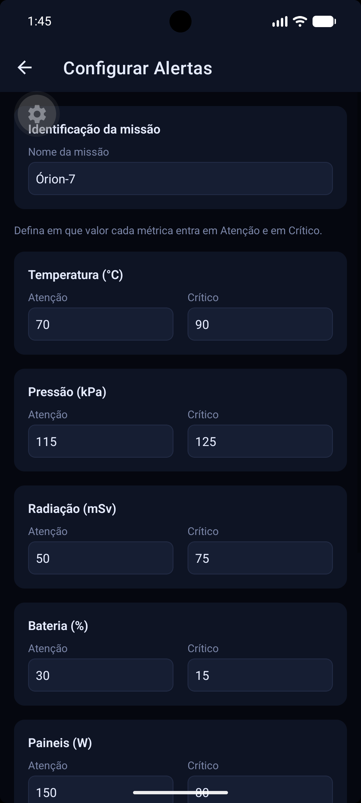

# 🛰️ Space Predictive Analytics

### Global Solution 2026.1 — Cross-Platform Application Development | FIAP



---

## 📖 Descrição

**Space Predictive Analytics** é um aplicativo mobile de monitoramento e análise preditiva
para operações espaciais simuladas. Ele coleta leituras (simuladas em tempo real) de
sensores, energia e comunicação de uma missão orbital, avalia cada métrica contra limiares
configuráveis e **gera alertas automáticos** quando algo entra em estado de atenção ou
crítico. O diferencial da solução é a arquitetura reativa: as leituras fluem por um estado
global único (Context API) e os alertas são *derivados* dos dados — nunca ficam
dessincronizados —, com feedback visual animado para os estados de risco.

---

## 👥 Equipe

| Nome | RM |
|------|----|
| Nelson Troccoli Santos Neto | RM562815 |
| Kauã da Silva Lazarim | RM564625 |

---

## 📱 Telas do Aplicativo

### Home — Dashboard Principal


Visão geral da missão: nome, status consolidado, contagem de alertas ativos e grade com
todos os indicadores (energia, temperatura, sinal e estabilidade orbital).

### Dashboard de Sensores


Temperatura, pressão e radiação, com gráfico de tendência das leituras recentes.

### Dashboard de Energia


Carga da bateria e geração dos painéis solares, com histórico da bateria.

### Dashboard de Comunicação


Qualidade do sinal e latência do link de telemetria, com gráfico do sinal.

### Alertas


Lista de alertas ativos gerados automaticamente, com nível de criticidade e ícone animado.

### Configurações / Formulário


Formulário com validação para o nome da missão e os limiares de Atenção/Crítico de cada métrica.

---

## ⚙️ Funcionalidades

- [x] Dashboards com indicadores em tempo real (simulado)
- [x] Sistema de alertas automáticos por limiar crítico
- [x] Persistência de limiares **e** das preferências da missão com AsyncStorage
- [x] Navegação com Expo Router (Tabs + Stack + modal)
- [x] Context API para o estado global da missão (consumido em todas as telas)
- [x] Formulário de configuração com validação e feedback de erro/sucesso
- [x] Animações com propósito (indicadores pulsam em estado de alerta) — *bônus*
- [x] Identidade visual temática (tema escuro espacial)
- [ ] Integração com NASA Open API (bônus — não implementado)

---

## 🧰 Tecnologias

- React Native `0.85.3`
- Expo SDK `~56`
- Expo Router (`~56.2.7`) — Tabs + Stack
- React Context API (estado global)
- AsyncStorage (`@react-native-async-storage/async-storage`)
- Animated API (React Native) — animações nativas
- `@expo/vector-icons` (Ionicons)

---

## ▶️ Como Executar

### Pré-requisitos
- Node.js instalado
- App **Expo Go** no celular (iOS ou Android), ou um emulador

### Instalação

```bash
# Clone o repositório
git clone https://github.com/nstgod/gs-2026-1-space-predictive-analytics.git

# Acesse a pasta do projeto
cd gs-2026-1-space-predictive-analytics

# Instale as dependências
npm install

# Inicie o projeto
npx expo start
```

Escaneie o QR Code com o Expo Go para rodar no dispositivo físico, ou pressione `w` para
abrir no navegador.

---

## 🎬 Vídeo de Demonstração

[🎥 Clique aqui para assistir à demonstração](https://www.youtube.com/watch?v=dEk5VUMIUGQ)

---

## 📄 Licença

Este projeto foi desenvolvido para fins acadêmicos — FIAP 2026.
